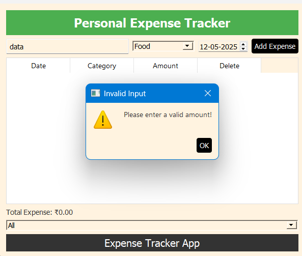
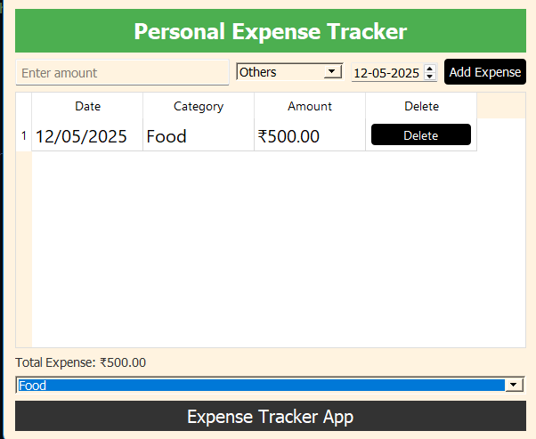

# Personal Expense Tracker (PyQt5)

----------------------------------------------------------------------------------------------------------------------------------------
#  Requirements
- Python 3.x
- PyQt5
----------------------------------------------------------------------------------------------------------------------------------------

A simple and intuitive **GUI application** to track your daily expenses. Built using **Python** and **PyQt5**, this app allows users to:

1)Add expenses by amount, category, and date
2)View expenses in a table format
3)Automatically calculate and show the total expense
4)Filter expenses by category
5)Delete individual entries
6)Enjoy a clean, styled interface with header and footer

----------------------------------------------------------------------------------------------------------------------------------------

# Features

  Add new expenses 
  View all expenses in a dynamic table
  Select date for each expense
  Automatically calculates total spending
  Delete individual expense entries
  Filter expenses by category (e.g., Food, Travel, Bills)
  Custom styled UI with background, styled buttons, and headers
----------------------------------------------------------------------------------------------------------------------------------------
# Function Overview

1) def add_expense(self):
        # Get input data
        amount = self.amount_input.text().strip()
        category = self.category_combo.currentText()
        date = self.date_picker.date().toString("dd/MM/yyyy")

        if not amount.isdigit():
            QMessageBox.warning(self, "Invalid Input", "Please enter a valid amount!")
            return

        # Add expense to the list
        self.expenses.append({"amount": float(amount), "category": category, "date": date})

        # Update the table
        self.update_table()

        # Clear input fields
        self.amount_input.clear()

 -->   It will Add expenses by amount, category, and date and check if amount is rather then number then it will show invalid input and of it number then it is simply add expense

    

2)  def update_table(self):
        # Clear the table
        self.table.setRowCount(0)

        # Add expenses to the table
        total = 0
        for row, expense in enumerate(self.expenses):
            self.table.insertRow(row)
            self.table.setItem(row, 0, QTableWidgetItem(expense["date"]))
            self.table.setItem(row, 1, QTableWidgetItem(expense["category"]))
            self.table.setItem(row, 2, QTableWidgetItem(f"₹{expense['amount']:.2f}"))

            # Add Delete button
            delete_button = QPushButton("Delete")
            delete_button.clicked.connect(lambda _, r=row: self.delete_expense(r))
            self.table.setCellWidget(row, 3, delete_button)

            total += expense["amount"]

        self.total_label.setText(f"Total Expense: ₹{total:.2f}")
 
 -->  It will update table by adding expense to table and add delete button to table and update total expens

3) def delete_expense(self, row):
        # Remove expense from the list
        del self.expenses[row]
        self.update_table()

 -->   It will delete expense from list and update table

4)  def filter_expenses(self):
        filter_category = self.filter_combo.currentText()

        # Filter the expenses by category
        filtered_expenses = []
        if filter_category == "All":
            filtered_expenses = self.expenses
        else:
            for expense in self.expenses:
                if expense["category"] == filter_category:
                    filtered_expenses.append(expense)

        # Update the table with filtered data
        self.expenses = filtered_expenses
        self.update_table()

-->    It will filter expense by category and update table.

---

